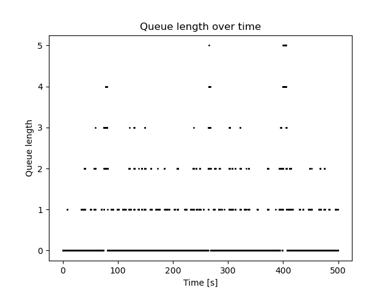

# M/M/1 Queue Simulation

## PL

### 📝 Przegląd
Projekt obejmuje symulację modelu kolejkowego M/M/1 oraz ich porównanie z wartościami teoretycznymi.
Implementacja zawiera:
- generowanie napływu
- symulacje oczekiwania w kolejce
- obsługę
- analizę statystyczną
- testy jednostkowe


### 🧱 Założenia modelu
1. Napływ klientów zgodny z rozkładem wykładniczym o intensywności $\lambda$
2. Czas obsługi zgodny z rozkładem wykładniczym o intenstywności $\mu$
3. Obsługa klientów wg. zasady FIFO (First In, First Out)
4. Jednostkowy serwer obsługi

Stabilność systemu występuje dla $\rho = \frac{\lambda}{\mu} \lt 1$
Dla $\rho$ > 1 system jest niestabilny tzn. kolejka może się rozciągnąć w nieskończoność


### 🧮 Wzory
Średni czas oczekiwania w kolejce:
$ W_q = \frac{\rho}{\mu - \lambda} $

Średnia liczba klientów w systemie:
$ L = \frac{\rho}{1-\rho} $

Średnia długość kolejki:
$ L_q = \frac{\rho^2}{1-\rho} $


### 🧩 Struktura
```text
.
├── mm1_queue.py     # logika symulacji M/M/1
├── server.py           # implementacja serwera kolejki
├── test_mm1_queue.py   # testy jednostkowe
├──  README.md
└── requirements.txt
```


### ⚙️ Architektura
1. QueueServer (server.py)
Odpowiada za logikę obsługi
 - przechowuje informacje o czasie zwolnienia
 - wyznacza czas rozpoczęcia obsługi
 - wyznacza czas zakończenia obsługi
 - oblicza czas oczekiwania klienta

2. MM1Simulation (mm1_queue.py)
Zarządza przebiegiem symulacji
- generuje czasy przybycia
- generuje czasy obsługi
- obsługa z wykorzystaniem klasy QueueServer
- zbiera dane statystyczne
- obliczanie wartości systemowych (Wq L, Lq)
- porównanie z teorią
- wizualizacja długości kolejki w czasie

### ▶️ Uruchomienie
1. Instalacja
pip install -r requirements.txt

2. Uruchomienie symulacji
python mm1_queue.py

### 🧪 Testy
Uruchomienie testów
python -m unittest test_mm1_queue.py
Testy obejmują:
- walidacja parametrów wejściowych
- obsługa niepoprawnych wartości $\lambda$, $\mu$ i czasu symulacji
- poprawność działania serwera kolejki

### 📊 Wyniki
Program wyświetla tabelę porównującą:
- wartości teoretyczne
- wartości uzyskane w symulacji
Dla stabilnego systemu ($\rho \lt 1$) wyniki symulacyjne zbliżają się do wartości teoretycznych.

Funkcja plot_queue_length() generuje wykres długości kolejki w czasie:
- oś X – czas symulacji
- oś Y – liczba klientów oczekujących



Poniższa tabela przedstawia porównanie wyników uzyskanych z symulacji z wartościami obliczonymi teoretycznie (dla $\rho = 0.75$):
| Metryka | Teoria | Symulacja |
| :--- | :---: | :---: |
| **$W_q$** (Śr. czas oczekiwania) | 0.36 | 0.36 |
| **$L$** (Śr. liczba klientów) | 0.75 | 0.76 |
| **$L_q$** (Śr. długość kolejki) | 0.32 | 0.33 |


### 👥 Autorzy

Projekt wykonany zespołowo.

Autorzy:
- Kamil Mędrek
- Liwia Zaborowska
---------------------------------------------
## EN

### 📝 Overview
The project includes a simulation of the M/M/1 queueing model and a comparison with theoretical values.  
The implementation includes:
- arrival generation
- queue waiting simulation
- service handling
- statistical analysis
- unit tests


### 🧱 Model Assumptions
1. Customer arrivals follow an exponential distribution with intensity $\lambda$
2. Service times follow an exponential distribution with intensity $\mu$
3. Customers are served according to the FIFO (First In, First Out) rule
4. Single service server

System stability occurs when $\rho = \frac{\lambda}{\mu} \lt 1$  
For $\rho > 1$ the system becomes unstable, meaning the queue may grow indefinitely.


### 🧮 Formulas
Average waiting time in the queue:
$ W_q = \frac{\rho}{\mu - \lambda} $

Average number of customers in the system:
$ L = \frac{\rho}{1-\rho} $

Average queue length:
$ L_q = \frac{\rho^2}{1-\rho} $


### 🧩 Structure
```text
.
├── mm1_queue.py        # M/M/1 simulation logic
├── server.py           # queue server implementation
├── test_mm1_queue.py   # unit tests
├── README.md
└── requirements.txt
```


### ⚙️ Architecture
1. QueueServer (server.py)  
Responsible for service logic:
 - stores information about server release time
 - determines service start time
 - determines service end time
 - calculates customer waiting time

2. MM1Simulation (mm1_queue.py)  
Manages the entire simulation process:
- generates arrival times
- generates service times
- handles customers using the QueueServer class
- collects statistical data
- computes system metrics (Wq, L, Lq)
- compares results with theoretical values
- visualizes queue length over time


### ▶️ Running
1. Installation  
pip install -r requirements.txt

2. Run simulation  
python mm1_queue.py


### 🧪 Tests
Run tests:  
python -m unittest test_mm1_queue.py  

Tests include:
- input parameter validation
- handling invalid $\lambda$, $\mu$ and simulation time values
- verification of queue server behavior


### 📊 Results
The program displays a comparison table including:
- theoretical values
- simulation results  

For a stable system ($\rho \lt 1$), simulation results converge toward theoretical values.

The function `plot_queue_length()` generates a queue length over time chart:
- X-axis – simulation time
- Y-axis – number of customers waiting


The table below presents a comparison between simulation results and theoretical values (for $\rho = 0.75$):

| Metric | Theory | Simulation |
| :--- | :---: | :---: |
| **$W_q$** (Avg. waiting time) | 0.36 | 0.36 |
| **$L$** (Avg. number of customers) | 0.75 | 0.76 |
| **$L_q$** (Avg. queue length) | 0.32 | 0.33 |


### 👥 Authors
The project was developed collaboratively.

Authors:
- Kamil Mędrek
- Liwia Zaborowska
